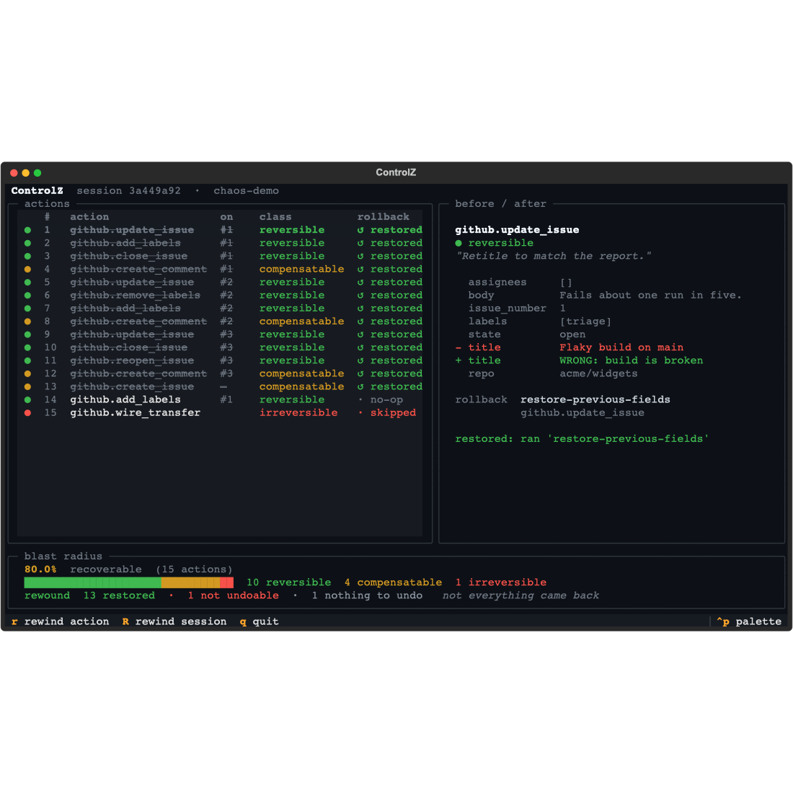
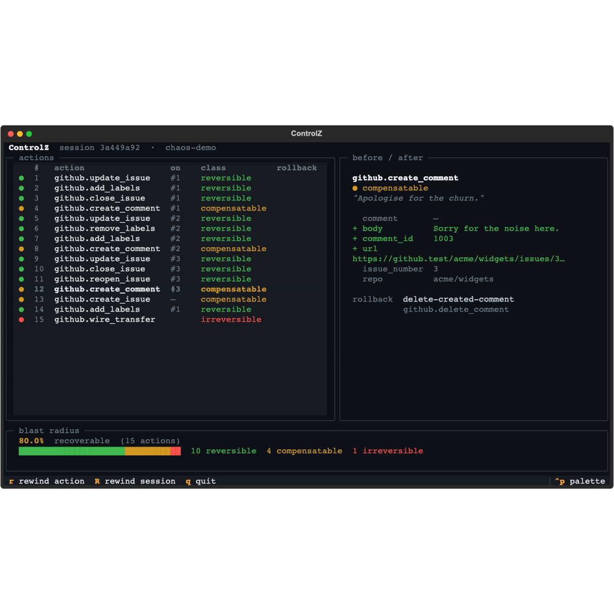

# ControlZ

**Undo for AI agents.** ControlZ records every action an agent takes, classifies how reversible each one is, and gives you one keypress to put the world back — while telling you honestly about the parts it cannot.

[](https://github.com/yahiakortam/controlZ/actions/workflows/ci.yml)
[](https://www.python.org/downloads/)
[](LICENSE)

<!--
  Launch GIF goes here. Record with:  cz watch --demo
  then replace the  below with:  
  Keep the still as a fallback until the GIF lands.
-->


Agents act on real systems. They open pull requests, send email, write files, move money. Most of that can be taken back, some of it can only be apologised for, and a little of it is permanent. ControlZ is the layer that knows the difference — **before** the agent acts, and after it goes wrong.

## Quickstart

```bash
git clone https://github.com/yahiakortam/controlZ && cd controlZ
pip install -e .

cz watch --demo          # watch an agent make 15 mistakes, then press R to rewind
python examples/rogue_agent.py   # the same story, without the TUI
```

Both run entirely in memory. No GitHub token, no network, nothing to clean up.

```python
from controlz import Ledger, Session, Tracker
from controlz.integrations.github import GitHubIntegration

tracker = Tracker(Ledger(Session(agent="triage-bot")), [GitHubIntegration(token="ghp_...")])

issue = tracker.tool("github").create_issue(repo="acme/widgets", title="Broken build")
report = tracker.rollback()  # undo the session, newest first
print(report.summary())  # "1 of 1 actions restored"
```

## How it works

```
   ┌─────────┐        ┌──────────────────────────────────┐        ┌──────────┐
   │  AGENT  │───────▶│            CONTROL Z             │───────▶│   TOOL   │
   └─────────┘        │                                  │        │  GitHub  │
        ▲             │  ① policy gate   may it run?     │        │  Slack   │
        │             │  ② snapshot      state before    │        │  Stripe  │
        │             │  ③ execute ──────────────────────┼───────▶│   ...    │
        │             │  ④ snapshot      state after     │◀───────┤          │
        │             │  ⑤ classify      how reversible? │        └──────────┘
        │             │  ⑥ plan          how to undo it  │
        │             └──────────────┬───────────────────┘
        │                            │ append
        │                            ▼
        │                     ┌─────────────┐
        │                     │   LEDGER    │  durable JSON
        │                     └──────┬──────┘
        │                            │
        │             ┌──────────────▼───────────────────┐
        └─────────────│  ROLLBACK   reverse dependency   │
          the world     │             order              │
          put back      │  re-check state · refuse drift │
                        │  report what could not return  │
                        └────────────────────────────────┘
```

Every call the agent makes passes through six steps. The ledger is a plain JSON file, so a session recorded in one process can be inspected, scored, and undone from another — or from the terminal, days later.

## Reversibility is the whole idea

Four classes, and one colour each. The colour means the same thing in the feed, the diff, and the footer:

| | class | meaning | example |
| --- | --- | --- | --- |
| 🟢 | `REVERSIBLE` | a direct inverse restores the prior state exactly | reopen a closed issue |
| 🟡 | `COMPENSATABLE` | no true inverse; a compensating action limits the damage | delete a comment people were already emailed about |
| 🔴 | `IRREVERSIBLE` | nothing undoes it | a settled wire transfer |
| ⚪ | `UNKNOWN` | not yet classified | anything ControlZ has not been taught |

`UNKNOWN` is the default, and it is deliberately the *unsafe* one: an unclassified action is treated as potentially irreversible until something proves otherwise.

## The four things it does

### 1. Records — the ledger

Every action lands as an `Action`: what was called, with what arguments, why, the state before, the state after, its reversibility, and the plan for undoing it. Written to disk atomically, reloadable anywhere.

### 2. Scores — before anything runs

```python
from controlz import reversibility_score

score = reversibility_score(planned_operations, github)
print(score.summary())
```

```
reversibility score: 80.0% over 15 actions
  10 reversible, 4 compensatable, 1 irreversible, 0 unknown
  blast radius: github x15 across 4 targets; 1 cannot be undone
  cannot be undone: github.wire_transfer [irreversible]
```

Coverage is weighted — reversible counts 1.0, compensatable 0.5, irreversible and unknown nothing. Compensation is real but partial: the retraction went out, but the email was still read.

### 3. Gates — policy in YAML

```yaml
minimum_score: 60              # block the task outright below this
on_reversible: allow           # ordinary work needs no supervision
max_compensatable: 3           # a few is fine, a pile is not
on_irreversible: require_approval
on_unknown: require_approval   # unclassified is treated as irreversible
```

```python
tracker = Tracker(ledger, [github], policy=Policy.from_yaml("controlz-policy.yaml"))
tracker.call("github", "create_issue", ...)  # PolicyViolation if the policy refuses
```

A blocked call never executes and is never recorded, because it never happened. A block is not approvable — approval is for judgement calls, and "this plan is 55% recoverable" is not one.

Aggregate rules (`minimum_score`, `max_compensatable`, `max_targets`) describe a *plan*, so they are applied by `tracker.check_policy(plan)`, which sees the whole thing. The per-call gate applies only the per-class rules — otherwise every lone compensatable call would be blocked for scoring 50% on its own, inside a plan the same policy would happily allow.

### 4. Rewinds — honestly

```python
report = session.rollback(github)
report.restored  # what came back
report.conflicts  # what had drifted, and was left alone
report.skipped_irreversible  # what nothing could undo
report.failures  # what was tried and raised
```

Three rules govern a rollback:

- **Order.** Reverse *dependency* order — anything built on another action is undone first.
- **Never overwrite a surprise.** The live state is re-read and compared before restoring anything. If someone else edited the field being restored, the action is marked `CONFLICT` and left alone until a human confirms. If the state cannot be read at all, that counts as drift too — an unreadable target is not a green light.
- **Say what happened.** Every action appears in the report exactly once. `report.complete` means nothing is left to act on; `report.fully_restored` means everything actually came back. A session with one irreversible action is the first but not the second, and blurring those together is the dishonesty this whole layer exists to prevent.

## Async

Agent frameworks are async, so ControlZ is too. Every method that touches the
network has an awaitable twin, named the way LangChain names them:

```python
tracker = Tracker(ledger, [github])

await tracker.acall("github", "create_issue", repo="acme/widgets", title="Broken build")
report = await tracker.arollback()
```

`atrack`, `acall`, `arollback`, `arollback_action`, `session.arollback()`,
`ledger.asave()`, `ledger.aload()`. Behaviour is identical to the sync path —
same classifications, same conflict refusals, same honest report. A parity test
runs the same mess through both and asserts the actions and reports match.

**Existing integrations work unchanged.** Each async hook defaults to running
its blocking twin in a worker thread, which is the correct thing to do for the
many SDKs that are synchronous — PyGithub among them. The event loop stays free:

```python
# four calls to a blocking SDK, overlapped rather than serialized
await asyncio.gather(*(tracker.acall("github", "close_issue", ...) for ... ))
```

An integration built on an async client overrides `asnapshot`, `aexecute`,
`acheck_conflict`, and `aexecute_rollback` to await for real. `classify` and
`build_rollback_plan` have no async twins on purpose — one is a dictionary
lookup, the other is pure computation over state already in hand.

Approval callbacks may be async, which matters because asking a human usually
means a network round trip:

```python
async def approve(decision):
    return await ask_in_slack(decision.summary())

tracker = Tracker(ledger, [github], policy=policy, approve=approve)
```

Two deliberate choices worth knowing:

- **Rollback is sequential, not concurrent.** A rollback is a chain of causally
  related undos and the ordering guarantees are the whole point. Async keeps the
  loop free while waiting on the network; it does not parallelise the unwind.
- **Appends happen on the loop.** Serialization for a save is done on the loop
  and only the file write goes to a thread, so concurrent `atrack` calls cannot
  lose an action or serialize a list mid-mutation.

## The watch window

```bash
cz watch --demo          # in-memory chaos agent, no credentials
cz watch run.json        # follow a real agent's ledger as it writes
```



Actions stream in as the agent works. Select a row and the right pane diffs exactly what it changed — `-` for what was there, `+` for what replaced it, untouched fields dim. Press `R` and the session comes undone one row at a time.

| key | |
| --- | --- |
| `↑` `↓` / `j` `k` | select an action |
| `r` | rewind the selected action |
| `R` | rewind the whole session |
| `q` | quit |

Other commands:

```bash
cz score run.json        # blast-radius readout for a recorded session
cz rollback run.json     # rewind from the terminal (--dry-run, --force)
```

## What it does not do

**[Read LIMITATIONS.md.](LIMITATIONS.md)** ControlZ cannot unsend a notification, cannot undo what a webhook did downstream, and cannot help with an action that was never recorded. Knowing the edges is the point of using it.

## Supported integrations

| tool | operations |
| --- | --- |
| **GitHub** | `create_issue`, `update_issue`, `add_labels`, `remove_labels`, `close_issue`, `reopen_issue`, `create_comment`, `delete_comment` |
| **In-memory GitHub** | the same surface, no credentials — for demos and tests |

Adding another is a single class with five methods: see [CONTRIBUTING.md](CONTRIBUTING.md#adding-an-integration). Slack ([#1](https://github.com/yahiakortam/controlZ/issues/1)) and HubSpot ([#2](https://github.com/yahiakortam/controlZ/issues/2)) are open as good first issues.

## Documentation

| | |
| --- | --- |
| [LIMITATIONS.md](LIMITATIONS.md) | What ControlZ cannot undo, stated plainly |
| [CONTRIBUTING.md](CONTRIBUTING.md) | How to add an integration, and the house rules |
| [ROADMAP.md](ROADMAP.md) | Where this is going, and where to start |
| [examples/](examples/) | A rogue agent, end to end |

## Development

```bash
pip install -e ".[dev]"
pytest                  # 370 tests; live GitHub tests skip themselves
ruff check . && ruff format --check .
```

The live suite runs against a real repository and is skipped unless both are set:

```bash
export CONTROLZ_GITHUB_TOKEN=ghp_...
export CONTROLZ_TEST_REPO=you/throwaway   # a repo you do not mind mutating
pytest -m live
```

`controlz.integrations.memory.InMemoryGitHub` is a working in-memory GitHub — pass it to `GitHubIntegration(client=...)` and everything runs with no credentials. The demo and most of the test suite use it.

## License

Apache-2.0. See [LICENSE](LICENSE).
